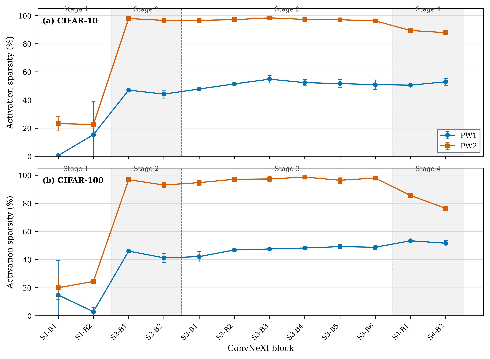

# Layer-wise activation sparsity

## Figure



Vector formats: [PDF](layer_sparsity_cifar10_cifar100.pdf) | [SVG](layer_sparsity_cifar10_cifar100.svg)

## Method

Layer-wise activation sparsity was aggregated over seeds 42, 6543, and 7777. Values are the arithmetic mean +/- sample standard deviation (n - 1) across three independently trained models. The evaluated dense-depthwise, dense-downsampling configuration contains 24 TTFS measurement points: PW1 and PW2 outputs in each of 12 ConvNeXt blocks.

## Elsevier-ready caption

**Fig. 1.** Layer-wise TTFS activation sparsity for (a) CIFAR-10 and (b) CIFAR-100. Markers denote the mean across three random seeds (42, 6543, and 7777), and error bars denote sample standard deviation. PW1 and PW2 indicate the first and second pointwise transformations within each ConvNeXt block. Dashed vertical lines separate the four network stages.

## Layer statistics

| Dataset | Layer | PW1 sparsity mean +/- SD (%) | PW2 sparsity mean +/- SD (%) |
|---|---:|---:|---:|
| CIFAR-10 | S1-B1 | 0.49 +/- 0.41 | 23.18 +/- 5.14 |
| CIFAR-10 | S1-B2 | 15.36 +/- 23.44 | 22.62 +/- 2.50 |
| CIFAR-10 | S2-B1 | 47.04 +/- 0.81 | 97.92 +/- 0.54 |
| CIFAR-10 | S2-B2 | 44.18 +/- 2.82 | 96.61 +/- 0.68 |
| CIFAR-10 | S3-B1 | 47.81 +/- 0.06 | 96.65 +/- 0.31 |
| CIFAR-10 | S3-B2 | 51.44 +/- 0.90 | 97.10 +/- 0.13 |
| CIFAR-10 | S3-B3 | 54.81 +/- 2.65 | 98.41 +/- 0.20 |
| CIFAR-10 | S3-B4 | 52.33 +/- 2.26 | 97.28 +/- 1.41 |
| CIFAR-10 | S3-B5 | 51.67 +/- 2.94 | 97.06 +/- 0.75 |
| CIFAR-10 | S3-B6 | 50.95 +/- 3.38 | 96.27 +/- 0.90 |
| CIFAR-10 | S4-B1 | 50.56 +/- 0.77 | 89.42 +/- 0.45 |
| CIFAR-10 | S4-B2 | 52.95 +/- 2.38 | 87.87 +/- 0.57 |
| CIFAR-100 | S1-B1 | 14.75 +/- 24.80 | 19.94 +/- 8.43 |
| CIFAR-100 | S1-B2 | 2.94 +/- 3.08 | 24.45 +/- 1.26 |
| CIFAR-100 | S2-B1 | 46.01 +/- 0.85 | 96.76 +/- 0.44 |
| CIFAR-100 | S2-B2 | 41.19 +/- 3.10 | 93.00 +/- 1.90 |
| CIFAR-100 | S3-B1 | 42.08 +/- 3.76 | 94.69 +/- 1.94 |
| CIFAR-100 | S3-B2 | 46.82 +/- 1.17 | 97.05 +/- 0.61 |
| CIFAR-100 | S3-B3 | 47.51 +/- 0.77 | 97.29 +/- 1.75 |
| CIFAR-100 | S3-B4 | 48.20 +/- 0.92 | 98.63 +/- 0.33 |
| CIFAR-100 | S3-B5 | 49.19 +/- 1.39 | 96.37 +/- 2.24 |
| CIFAR-100 | S3-B6 | 48.74 +/- 1.55 | 97.93 +/- 0.82 |
| CIFAR-100 | S4-B1 | 53.35 +/- 0.61 | 85.53 +/- 1.08 |
| CIFAR-100 | S4-B2 | 51.60 +/- 1.96 | 76.41 +/- 0.98 |

## Interpretation

PW2 is consistently sparser than PW1 through most blocks, especially in the middle stages. The earliest PW1 layers remain comparatively dense, while later stages exhibit substantially higher sparsity. Error bars expose seed sensitivity and should be retained in the published figure.

## Reproduction

```powershell
C:\Users\jafari.h\Desktop\ai_project\.venv\Scripts\python.exe .\Evaluation\layer_sparsity_figure\generate_layer_sparsity_figure.py
```

Underlying values: [CSV](layer_sparsity_mean_std.csv)
